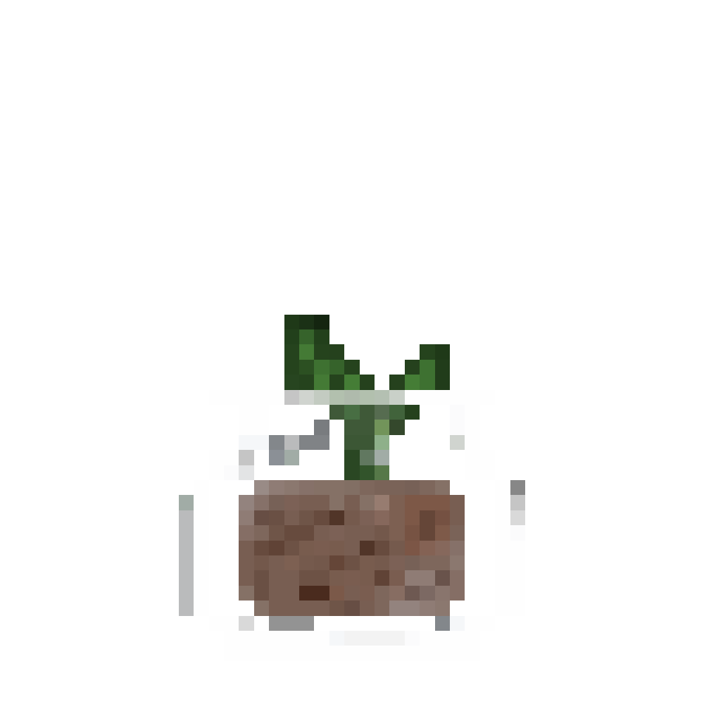

# Habit Tracker

(work in progress...) <br>

This is a habit tracker app that allows users to organise and efficiently track their habits. <br>

I decided to build this react app as I was looking for a habit tracker that combines all the features I want in one application. So I decided to tailor this app to my personal needs and desired aesthetic. I wanted a fun way for people to list down there habits to appear more like a game. So they are able to grow a plant everytime they complete a habit. Therefore, users will be encouraged to complete their habits.

All designs and plant assets were designed and drawn by me
<br>



<br>

## Features:

- Ability to cross out completed habit ✅
- Be able to upload images
- Re-order habits by desired order ✅
- Can set up reminder/notification for a habit
- Can set up a focused timer for a specific habit
- See your progress through an interactive plant that grows with you! The more you complete your tasks the plant flourishes! ✅
- View Plant Collection ✅
- Be able to view deleted habits ✅
- Be able to recover deleted habits ✅
- Responsive across mobile, tablet and desktop view ✅

## Technical Process:

- I chose to incorporate LocalStorage to save the list in the browser. This enables users to view their personal list.
- Used zod to define type
  ...

### Plant.tsx

#### Feature:

- Users get assigned a random plant seed.
- Every 10 habit they complete, increment the plant's level
- Pass the current level and image source according to the level
- Whenever the plant reaches level 4, notify the user about the new seed
- Whenever a habit is completed, it helps the seed grow into a plant ---> to promote productivity
- They can view their collection of plants over time.
- There are 5 groups of plant assets. Therefore, users get assigned a random plant to grow. So they get a 'new seed'.
- To assign a user a new plant I randomly assign them a random number which signifies a particular group of assets. Each group are represent a particular plant type

### PlantCollection.tsx

#### Feature:

- Displays all the fully grown plants
- I retrieve a list of image urls to display the level 4 plants

  ```js
  useEffect(() => {
    const savedPlants = getCompletedPlants() // Retrieves the plant collection from localStorage
    setPlantCollection(savedPlants) // Stores the retrieved plant collection
  }, []) // An empty array to insert the retrieved data
  ```

### localStorageUtils.ts

- Contains functions that handles data in the local storage

### HabitList.tsx

````js
const imagePath = `public/images/plant/plant-type-${
				plantTypeIndex + 1
			}-4.jpg`; // to ensure that I retrieve the right plant level I hard coded number '4' as it's the final level of the plant

	```
````

- I implemented @hello-pangea/dnd to handle the drag and drop functionality of the habit tracker

```js
// Handles Drag and Drop functionality
const onDragEnd = (result: DropResult) => {
  const { destination, source } = result
  if (!destination) return

  const updatedList = Array.from(list)
  const [removed] = updatedList.splice(source.index, 1)
  updatedList.splice(destination.index, 0, removed)

  // Sets new state
  setList(updatedList)

  // Stores reordered list in local storage
  setHabitsInLocalStorage(updatedList)
}
```

### deletedHabitsUtils.ts

```js
export function recoverDeletedHabitToActiveList(habit: DeletedHabit): void {
  // Get deleted habits from local storage
  const deletedHabits = getDeletedHabitsFromLocalStorage()

  // Remove the habit from the deleted list
  const updatedDeletedHabits = deletedHabits.filter((h) => h.id !== habit.id)
  setDeletedHabitsInLocalStorage(updatedDeletedHabits)

  // Convert the DeletedHabit type to the Habit type if needed
  const activeHabit = {
    id: habit.id,
    text: habit.text,
    completed: habit.completed,
  }

  // Get active habits from local storage
  const activeHabits = getHabitsFromLocalStorage()

  // Add the habit to the active habits list
  activeHabits.push(activeHabit)
  setHabitsInLocalStorage(activeHabits)
}
```
